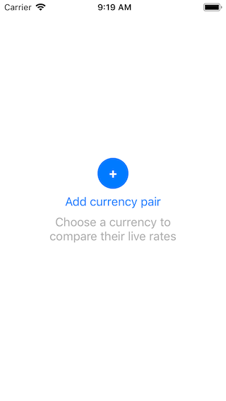
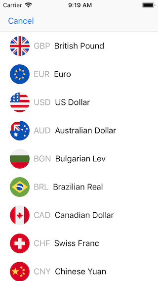
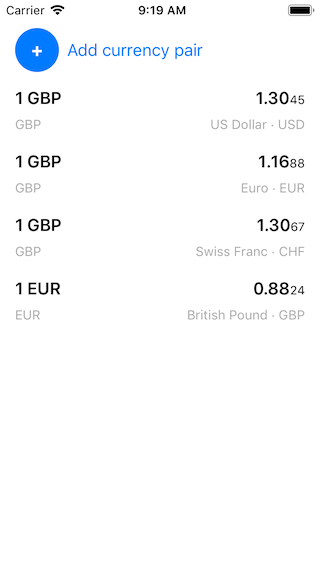

# Exchange Rates

Revolut iOS Test Assignment

Application didn't pass expected minimum requiremets with follwing commnet: 

> The application looks nice and it complies with the requirements. Design pattern used in code is clean, usage of Coordinators for navigation is a great plus, however:

>There is a bug - when you have many currencies and you swipe down and up, row gets rendered with it's initial value for currency. There are broken constraints listed in the console warnings. Rates observing is located inside of a cell where it does not belong. There should be more flexible mechanism of mocking in unit tests, right now developer is forced to create new classes for different mocked data. There's lack of proper handling of the Timer when app disappears/classes deinitialize. The application has glitchy animation when removing last row of currency pairs.

